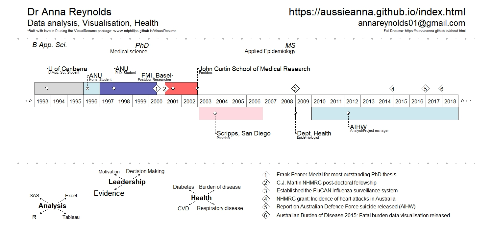

 
## About me
I enjoy analyzing data to answer research questions. I have experience in medical science and a passion for epidemiology and public health with interests in both communicable and non-communicable diseases.  
My current interests include:  
    **Burden of disease** 
    **Cardiovascular disease**  
    **Mortality in Australia**  
    **Respiratory diseases**  
    **Musculoskeletal diseases**
    **Influenza** 

### Visual CV   

### Education     
**Master of Applied Epidemiology**  
National Centre for Epidemiology and Public Health,   
Australian National University

**PhD (Medical Science)**  
Division of Neuroscience, Developmental Neurobiology Group,  
John Curtin School of Medical Research, ANU  

**Bachelor of Science (Hons) First Class Honours**  
ANU

**Bachelor of Appl. Sci. (Medical Laboratory Science)**  
University of Canberra

[**Download full CV here**](https://github.com/aussieanna/aussieanna.github.io/blob/master/Anna_Reynolds_CV.pdf)

